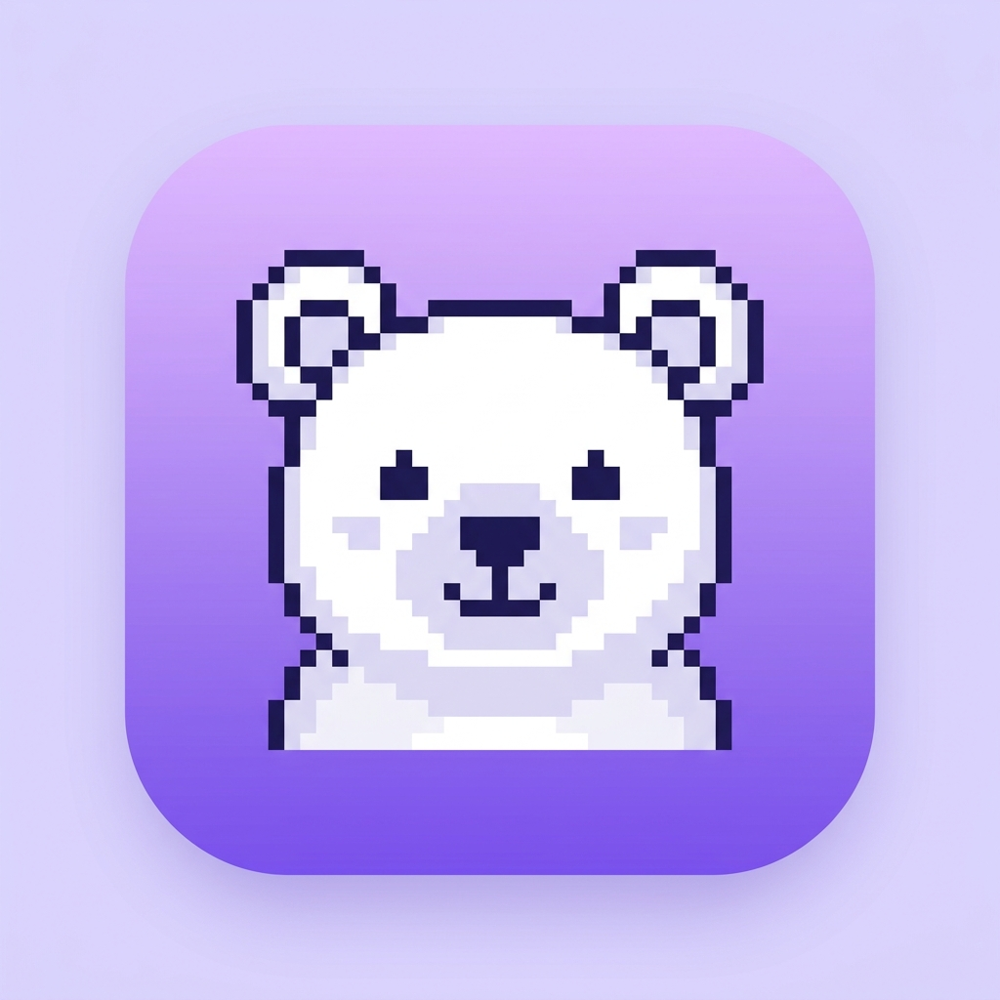

<p align="center">
  
</p>

<h1 align="center">FrameBear</h1>

<p align="center">
  <strong>The AI that makes product videos.</strong><br>
  Give it a prompt, a reference video, and your brand. Get a polished MP4.
</p>

<p align="center">
  <a href="https://frame-bear.vercel.app">🌐 Live Site</a> · 
  <a href="https://aistudio.google.com/apikey">🔑 Get API Key</a> · 
  <a href="#supported-models">🤖 Models</a>
</p>

---

## Quick Start

```bash
git clone https://github.com/NotDrake100/FrameBear.git
cd FrameBear
npm install
```

### 1. Connect your AI model

```bash
npx framebear init
```

Select your model (Gemini 2.0 Flash is free) and enter your API key.

### 2. Generate a video

```bash
npx framebear generate \
  --prompt "Dinner expense tracker promo, iMessage style" \
  --company "MyBrand" \
  --reference reference.mp4
```

### 3. Done

```
▸ Analyzing reference video...
▸ Generating HTML animation...
▸ Rendering 150 frames at 30fps...
✓ Saved → rendered/mybrand_promo.mp4

Done in 12.3s — open with: open rendered/mybrand_promo.mp4
```

## Commands

| Command | Description |
|---------|-------------|
| `framebear init` | Configure your AI model & API key |
| `framebear generate` | Generate a video from a prompt |
| `framebear models` | List all supported models |
| `framebear help` | Show help |

## Generate Options

| Flag | Description |
|------|-------------|
| `--prompt` | Describe your video |
| `--company` | Your brand name |
| `--reference` | Path to a reference video |
| `--output` | Custom output path |

> **Tip:** You can just run `npx framebear generate` with no flags, and it becomes an interactive terminal that asks you for these values. When it asks for the reference video, you can just **drag and drop** the `.mp4` file right into your terminal!

## Supported Models

| Model | Provider | Notes |
|-------|----------|-------|
| Gemini 2.0 Flash | Google | Free tier · Recommended |
| Gemini Pro | Google | Advanced reasoning |
| GPT-4o | OpenAI | Vision + code |
| GPT-4o Mini | OpenAI | Fast & cheap |
| Claude Sonnet | Anthropic | Strong at code |
| Claude Opus | Anthropic | Most capable |
| Llama 3 | Meta | Run locally |
| DeepSeek | DeepSeek | V3 / Coder |
| Ollama | Local | Any local model |
| LM Studio | Local | GUI for local models |
| Mistral | Mistral AI | Large / Medium |
| Groq | Groq | Ultra-fast inference |

## Requirements

- Node.js 18+
- Chrome/Chromium (installed automatically by Playwright)
- FFmpeg (`brew install ffmpeg` on macOS)

## Live Site

**🌐 [frame-bear.vercel.app](https://frame-bear.vercel.app)**

## License

MIT © [NotDrake100](https://github.com/NotDrake100)
